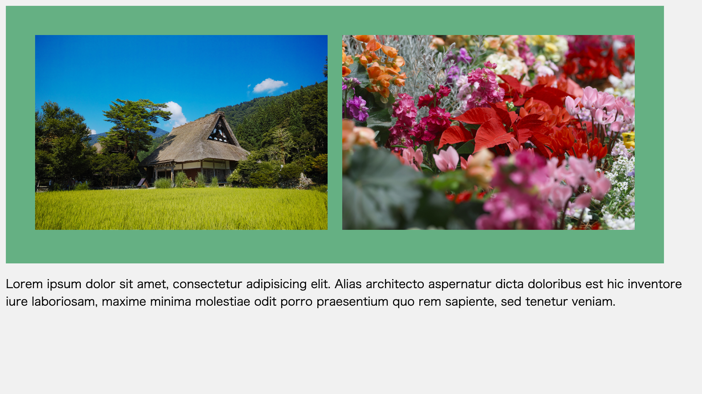

### clearfixによる回り込み解除がいらなくなる`display: flow-root`

`display`プロパティの`flow-root`値とは、要素の[ブロック整形コンテキスト（block formatting context、BFC）](https://developer.mozilla.org/ja/docs/Web/Guide/CSS/Block_formatting_context)を作成するための値です。

次のようにして使います。

```css
.container {
  display: flow-root;
}
```

`display: flow-root;`は、フロートした要素の周りこみ解除で便利です。次のようなレイアウトを実装するケースで考えてみましょう。画像が2つ横並びになっていて、その後にテキストが続いています。



HTMLコードは次のような形です。

```html
<div class="container">
  <div class="box1"></div>
  <div class="box2"></div>
</div>

<p>
  Lorem ipsum dolor sit amet（中略）
</p>
```

画像の横並び部分は`float`プロパティを使ってレイアウトします。

```css
.box1 {
  float: left;
}

.box2 {
  float: right;
}
```


`float`プロパティにより要素をフロート（左寄せ・右寄せ）にする場合は、後続の要素がフロートされた要素が重なってしまいます。従来は、この問題を解決するためにはclearfixなどが使われてきました（参考記事「[floatを解除する手法のclearfix と 次世代のレイアウトの話 \| Web Design KOJIKA17](https://kojika17.com/2013/06/clearfix-2013.html)」）。

▼ clearfixの例

```css
.container:after {
  content: "";
  clear: both;
  display: block;
}
```

`display: flow-root;`を使えば、`clearfix`を使うことなくフロートの回り込み解除ができます。


```css
.container {
  display: flow-root;
}
```

実行結果は次のとおりです。

<amp-iframe width="960" height="540" sandbox="allow-scripts" layout="responsive" src="https://ics-creative.github.io/200217_edge_css/display_flow_root//"></amp-iframe>

- [デモを別ウインドウで再生する](https://ics-creative.github.io/200217_edge_css/display_flow_root/)
- [ソースコードを確認する](https://github.com/ics-creative/200217_edge_css/tree/master/display_flow_root)
